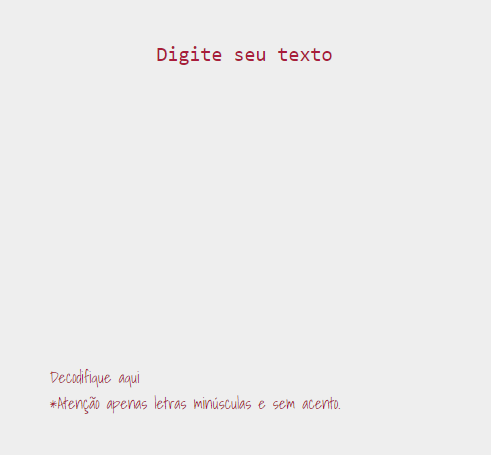
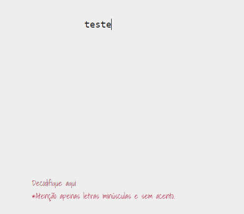
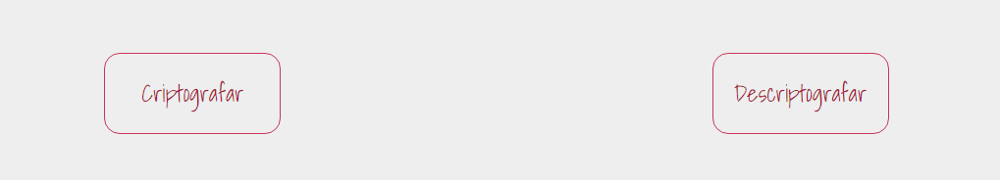
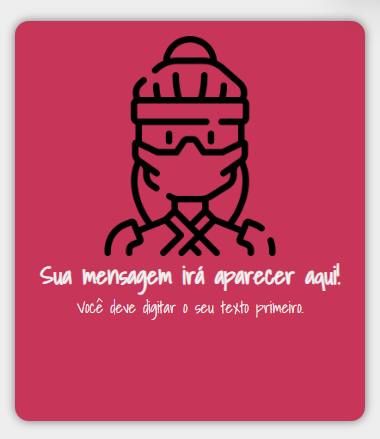
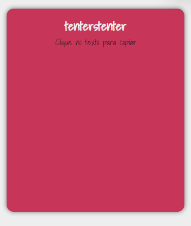

<h1 align="center"> Projeto decodificador - Oracle ONE </h1>

<h2 align="center">Olá, este é um decodificador/codificador de texto simples, baseado em substituição de palavras por outros valores.</h2>

1 - Insira o texto que quer codificar ou decodificar.

2 - Clique no botão relacionado ao que deseja fazer.

3 - O programa retornará o resultado e você pode copiá-lo clicando no texto, caso queira. :)

# :hammer: Funcionalidades do projeto

- `Codificar`:  "e" é convertida para "enter", A letra "i" é convertida para "imes", A letra "a" é convertida para "ai", A letra "o" é convertida para "ober", A letra "u" é convertida para "ufat".
- `Decodificar`: Reverte o primeiro processo.
- `Copiar`: Usa o clique do mouse sobre o texto como "gatilho" para copiá-lo.

<h4 align="center"> 
    :warning:  Projeto feito inicialmente para web, por enquanto ainda não possui responsividade correta para telas menores.  :warning:
</h4>

